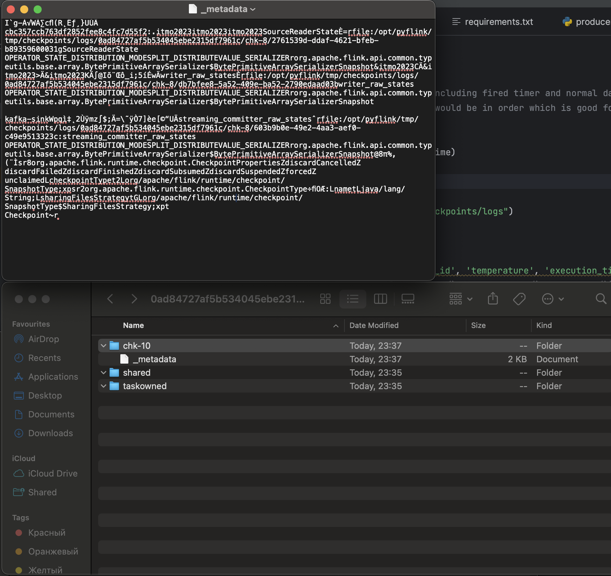
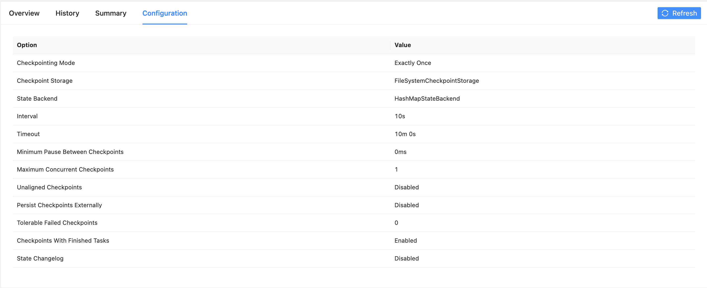
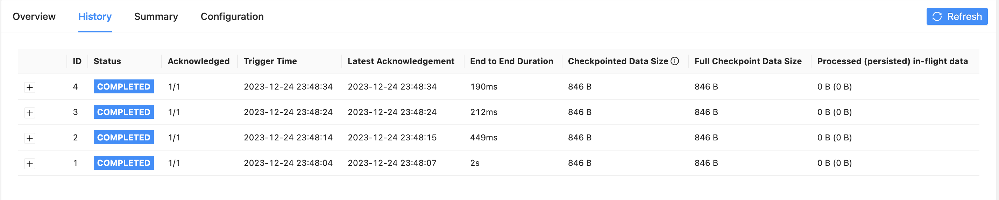

Для сохранения чекпоинтов в файл добавил следующую конфигурацию

```python
env.enable_checkpointing(10_000, CheckpointingMode.EXACTLY_ONCE)
env.get_checkpoint_config().set_checkpoint_storage(
    FileSystemCheckpointStorage("file:///opt/pyflink/tmp/checkpoints/logs")
)
```

Для запуска джобы использовал следующую команду:

`docker-compose exec jobmanager ./bin/flink run -py /opt/pyflink/device_job.py -d`

А consumer и producer можно запустить с помощью `python <consumer|producer>.py`

## Скриншот локальной директории


## Скриншоты из Flink UI


