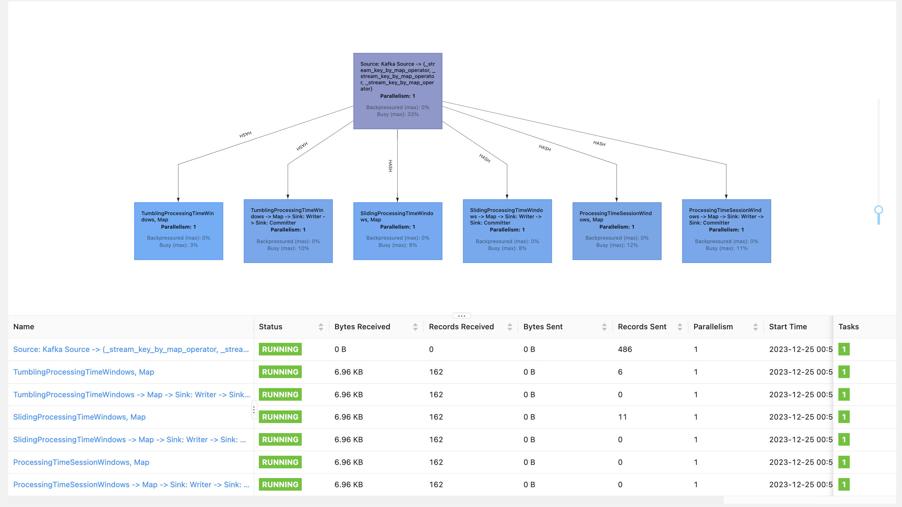

В первую очередь, нужно создать очереди под каждый из вариантов агрегации:

```bash
docker-compose exec kafka kafka-topics.sh --bootstrap-server kafka:9092 --create --topic itmo2023-processed-tumbling-window --partitions 3 --replication-factor 1
docker-compose exec kafka kafka-topics.sh --bootstrap-server kafka:9092 --create --topic itmo2023-processed-sliding-window --partitions 3 --replication-factor 1
docker-compose exec kafka kafka-topics.sh --bootstrap-server kafka:9092 --create --topic itmo2023-processed-session-window --partitions 3 --replication-factor 1
```

Далее нужно загрузить соответствующую джобу в flink командой:
`docker-compose exec jobmanager ./bin/flink run -py /opt/pyflink/max_temperature_window_job.py -d`, запустить producer с помощью команды `python producer.py` и соответствующие консьюмеры

